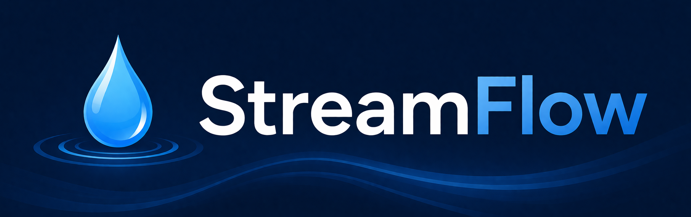

<div align="center">



**StreamFlow — Real-Time Vietnamese Stock Market Dashboard**


</div>


## ✨ Features

| | |
|---|---|
|  **Bloomberg-style iBoard** | Dense dark terminal board — 27 columns, 9 segment tabs, real-time flash updates |
|  **TradingView Charts** | Candlestick + volume histogram via `lightweight-charts v4` with MA overlays |
|  **Market Breadth** | Live advances / declines / unchanged for VNINDEX, VN30, HNXIndex, HNX30 |
|  **Low-latency Pipeline** | SSI WebSocket → Kafka KRaft → MySQL streaming tables → FastAPI → WebSocket |
|  **OHLCV Aggregation** | 1m/1d candlesticks computed in real-time by CandlestickConsumer |
|  **Star-schema DW** | Spark ETL → `warehouse.dim.*` + `warehouse.fact.*` for historical queries |
|  **JWT Authentication** | Secure watchlists, per-user watchlists persisted in `api` DB |
|  **WebSocket Live Feed** | Per-symbol and market-wide push updates with 3s auto-reconnect |

---

## Quick Start

### 1. Clone & configure

```bash
git clone https://github.com/bazzi24/streamflow.git
cd streamflow
cp .env.example .env
```

Fill in `.env` with your [SSI](https://www.ssi.com.vn/) credentials:

```env
consumerID=<your_ssi_consumer_id>
consumerSecret=<your_ssi_consumer_secret>
url=https://fc-data.ssi.com.vn/
stream_url=https://fc-datahub.ssi.com.vn/
```

### 2. Install Python dependencies

```bash
uv venv
source .venv/bin/activate
uv sync
```

### 3. Download MySQL JDBC driver

```bash
mkdir -p lib
curl -L -o lib/mysql-connector-j-8.0.33.jar \
  "https://repo1.maven.org/maven2/com/mysql/mysql-connector-j/8.0.33/mysql-connector-j-8.0.33.jar"
```

### 4. Launch everything

```bash
docker compose -f docker/docker-compose.yaml up -d 
```

Wait for Kafka and MySQL to become healthy:

```bash
docker ps
# mysql   healthy
# kafka   running
# api     running
# frontend running
```

Open `http://localhost:3000` — the Bloomberg-style board is live.

> **First time?** Start the Kafka producers to begin ingesting market data:
> ```bash
> docker compose run --rm producer-trade  # X-TRADE:ALL
> docker compose run --rm producer-quote  # X-QUOTE:ALL
> docker compose run --rm producer-index  # MI:ALL
> docker compose run --rm producer-foreign # R:ALL
> docker compose run --rm producer-status # F:ALL
> ```

---

## Architecture

```
SSI WebSocket API
        │
        ▼
┌───────────────────────────────────────────────────────────────┐
│  kafkaStream/producer_market_data.py                          │
│  5 parallel producers → 5 Kafka topics (partitioned by symbol)│
│  topics: market_data_trade  market_data_quote                 │
│          index_data  foreign_room_data  securities_status     │
└────────────────────────────┬──────────────────────────────────┘
                             │ Kafka KRaft (6 partitions)
                             ▼
┌───────────────────────────────────────────────────────────────┐
│  consumer/*.py                                                │
│  5 consumers → MySQL data DB (batch_size=50,000)              │
│  + CandlestickConsumer (1m/1d OHLCV upserts)                  │
└────┬──────────────────────────────┬───────────────────────────┘
     │                              │
     ▼                              ▼
data.streaming                 data.corporation / data.market
(raw tick tables)             (reference: symbols, sectors, exchanges)
     │
     ├──────────────────┬────────────────────────────────────────┐
     ▼                  ▼                                        ▼
data.candlestick    warehouse.dim                              warehouse.fact
(pre-computed OHLCV) (Spark ETL — date, time, symbol, exchange)  (Spark ETL)
     │
     └──────────────────┬───────────────────────────────────────┘
                        ▼
┌───────────────────────────────────────────────────────────────┐
│  api_service/src/  —  FastAPI REST + WebSocket                │
│  • Kafka → WebSocket bridge (aiokafka)                        │
│  • 2 DB engines: warehouse (DW) + data (streaming)            │
│  • JWT auth, watchlist API, REST reads + WebSocket push       │
└────────────────────────────┬──────────────────────────────────┘
                             │ REST + WebSocket
                             ▼
┌───────────────────────────────────────────────────────────────┐
│  frontend/src/  —  React 18 + Vite + TypeScript               │
│  • PriceBoardPage — Bloomberg-style dark board (default)      │
│  • ChartPageV2    — white TradingView dashboard               │
│  • lightweight-charts v4 + Zustand + React Query              │
└───────────────────────────────────────────────────────────────┘
```

---

## Tech Stack

| Layer              | Technology                                           |
|--------------------|------------------------------------------------------|
|  **Data source** | SSI (SSI Securities Corporation) WebSocket API              |
|  **Message broker** | Apache Kafka 3.x (KRaft, no ZooKeeper)            |
|  **Raw storage** | MySQL 8.0.39 (`data` DB)                           |
|  **DW storage**  | MySQL 8.0.39 (`warehouse` DB, star schema)          |
|  **ETL**         | Apache Spark 3.5.1 (PySpark)                        |
|  **API**         | FastAPI + Python 3.12 + aiokafka                    |
|  **Frontend**    | React 18 + Vite + TypeScript + Tailwind CSS         |
|  **Charts**      | TradingView `lightweight-charts v4`                 |
|  **Containers**  | Docker                               |

---

## Services

| Service        | Description                                  | Port    |
|----------------|---------------------------------------------|---------|
| `kafka`        | Kafka KRaft broker                          | 9092    |
| `kafka-ui`     | Kafka UI dashboard                          | 8080    |
| `mysql`         | MySQL 8.0.39 (`data` + `warehouse` DBs)   | 3306    |
| `spark-master`  | Apache Spark master                         | 7077    |
| `spark-worker`  | Spark worker (2 cores, 4 GB)                | —       |
| `api`          | FastAPI REST + WebSocket                    | 8000    |
| `frontend`     | React SPA served via Nginx                  | 80→3000 |
| `producer`     | All 5 Kafka producers (SSI channels)       | —       |
| `consumer`     | All 6 Kafka consumers (5 topics + OHLCV)    | —       |

---

## API Reference

Base: `http://localhost:8000/api/v1`

### REST Endpoints

| Endpoint                       | Method | Auth | Description                       |
|--------------------------------|--------|------|-----------------------------------|
| `/auth/register`               | POST   | —    | Register user                     |
| `/auth/login`                  | POST   | —    | Login → JWT (24h)                |
| `/users/me`                    | GET    | JWT  | Current user                     |
| `/users/me/watchlist`          | GET/PUT| JWT  | Watchlist CRUD                   |
| `/stocks`                      | GET    | —    | All symbols + latest prices        |
| `/stocks/{symbol}`              | GET    | —    | Symbol metadata                   |
| `/stocks/{symbol}/quote`        | GET    | —    | Live bid/ask from data DB         |
| `/stocks/{symbol}/orderbook`     | GET    | —    | Top 3 bid/ask levels             |
| `/stocks/{symbol}/ohlcv`        | GET    | —    | Intraday OHLCV (`?interval=1m`) |
| `/stocks/{symbol}/history`      | GET    | —    | Daily OHLCV (`?days=30`)         |
| `/market/overview`             | GET    | —    | Indices + top gainers/losers      |
| `/health`                      | GET    | —    | Health check                      |

### WebSocket Endpoints

| Endpoint              | Auth      | Description              |
|-----------------------|-----------|--------------------------|
| `/ws/stocks/{symbol}` | Optional  | Per-symbol live updates  |
| `/ws/market`          | Optional  | Market-wide updates      |

**Message types:** `price_update` · `orderbook_update` · `index_update` · `candlestick_update`

---

## Database Schema

Two MySQL databases — **`data`** (raw streaming + reference) and **`warehouse`** (star-schema DW).

### `data` — Raw + reference

| Table                  | Source topic       | PK / Index                        |
|------------------------|--------------------|------------------------------------|
| `data_trade`           | `market_data_trade`| `PRIMARY KEY (id)`, `INDEX(symbol,trading_date)` |
| `data_quote`           | `market_data_quote`| `PRIMARY KEY (id)`, `INDEX(symbol_id,trading_date)` |
| `index_data`           | `index_data`       | `PRIMARY KEY (id)`, `INDEX(index_id,trading_date)` |
| `foreign_room`         | `foreign_room_data`| `PRIMARY KEY (id)`, `INDEX(symbol,trading_date)` |
| `securities_status`    | `securities_status`| `PRIMARY KEY (id)`, `INDEX(symbol_id,trading_date)` |
| `candlestick_1m`       | CandlestickConsumer| `PRIMARY KEY (symbol, time_start)`  |
| `candlestick_1d`       | CandlestickConsumer| `PRIMARY KEY (symbol, trading_date)` |

> `candlestick_1m` is the **source of truth** for 1m OHLCV; larger timeframes are derived at query time.

### `warehouse` — Star-schema DW

| Dimension table | Key columns                  |
|----------------|------------------------------|
| `date`         | `tradingdate_key` (backtick-quoted) |
| `time`         | `time_key` (backtick-quoted) |
| `symbol`       | `symbol_key`                 |
| `market_index` | `index_key`                  |
| `exchange`     | `exchange_key`                |

| Fact table       | Composite PK (5 keys)                          |
|-----------------|------------------------------------------------|
| `stockorderbook` | `tradingdate_key, time_key, symbol_key, exchange_key, session_key` |
| `stocktrade`     | same as above                                  |
| `marketindex`    | `tradingdate_key, time_key, index_key, exchange_key, session_key` |


##  Environment Variables

| Variable                | Default                              | Purpose                              |
|-------------------------|--------------------------------------|--------------------------------------|
| `consumerID`            | —                                    | SSI API consumer ID                   |
| `consumerSecret`         | —                                    | SSI API consumer secret               |
| `url`                    | `https://fc-data.ssi.com.vn/`         | SSI REST API base                    |
| `stream_url`             | `https://fc-datahub.ssi.com.vn/`      | SSI WebSocket base                   |
| `RAW_DB_URL`             | `jdbc:mysql://mysql:3306/data?...`    | Spark reads data DB                  |
| `DW_DB_URL`              | `jdbc:mysql://mysql:3306/warehouse?...` | Spark writes warehouse DB           |
| `DB_DRIVER`              | `com.mysql.cj.jdbc.Driver`            | JDBC class                          |
| `KAFKA_BOOTSTRAP_SERVERS`| `kafka:9092`                         | All Kafka clients                    |
| `SPARK_MASTER_URL`       | `spark://spark-master:7077`          | spark-submit target                  |
| `MYSQL_JAR`              | `/streamflow/lib/mysql-connector-j-8.0.33.jar` | JDBC jar path                  |

---

##  Stopping

```bash
docker compose -f docker/docker-compose.yaml down            # stop containers (data persists)
docker compose -f docker/docker-compose.yaml down -v          # stop + remove volumes (data loss)
```

---

##  License

MIT License — [bazzi24](https://github.com/bazzi24)
